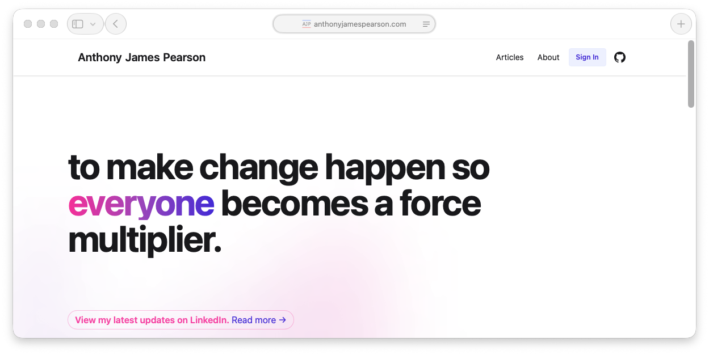
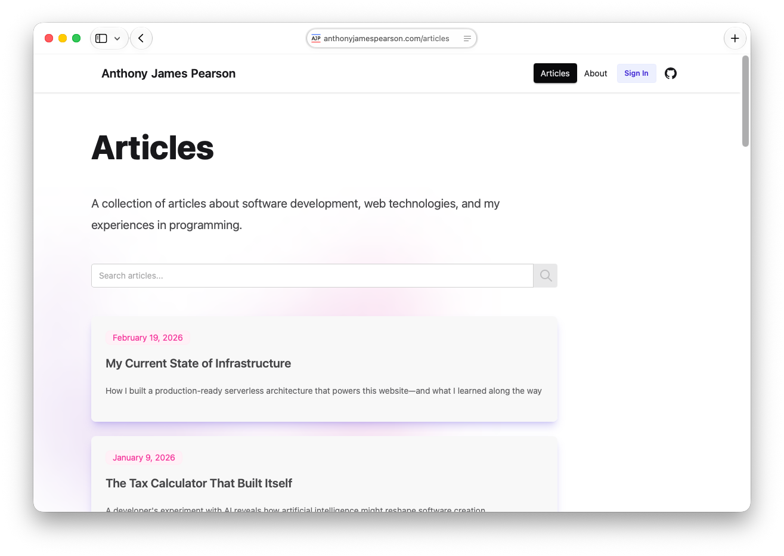
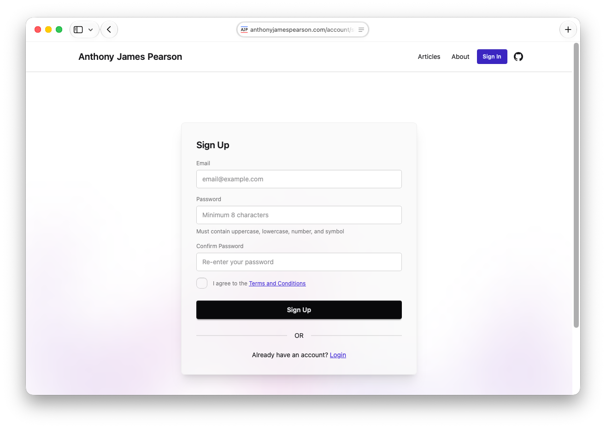
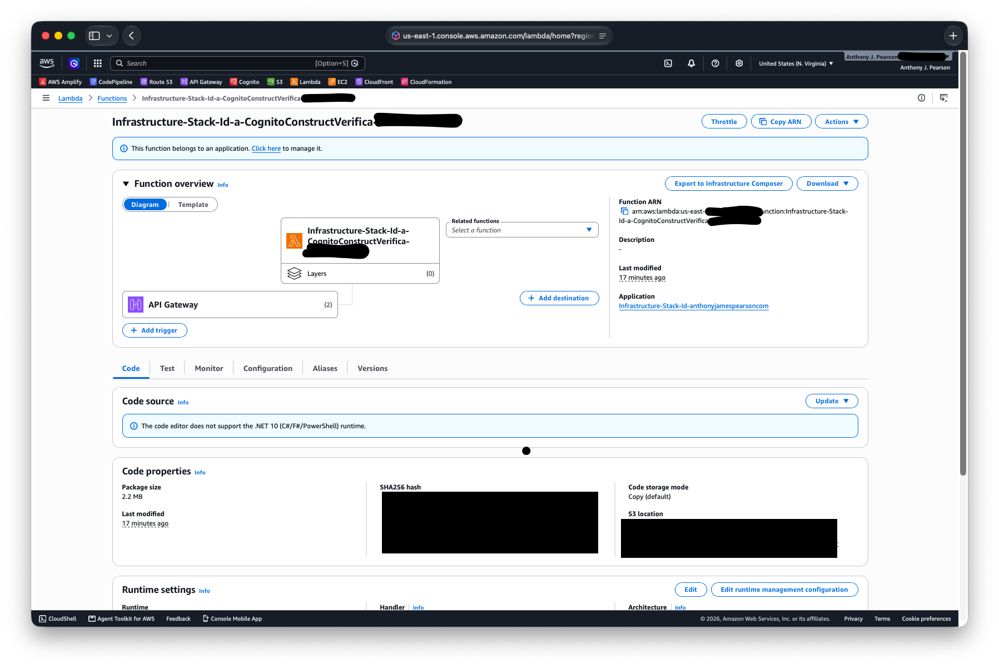
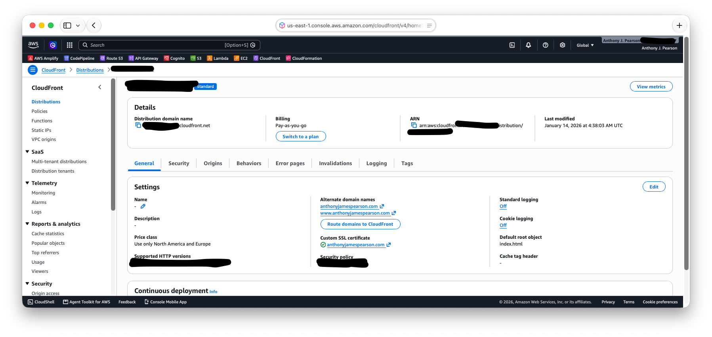
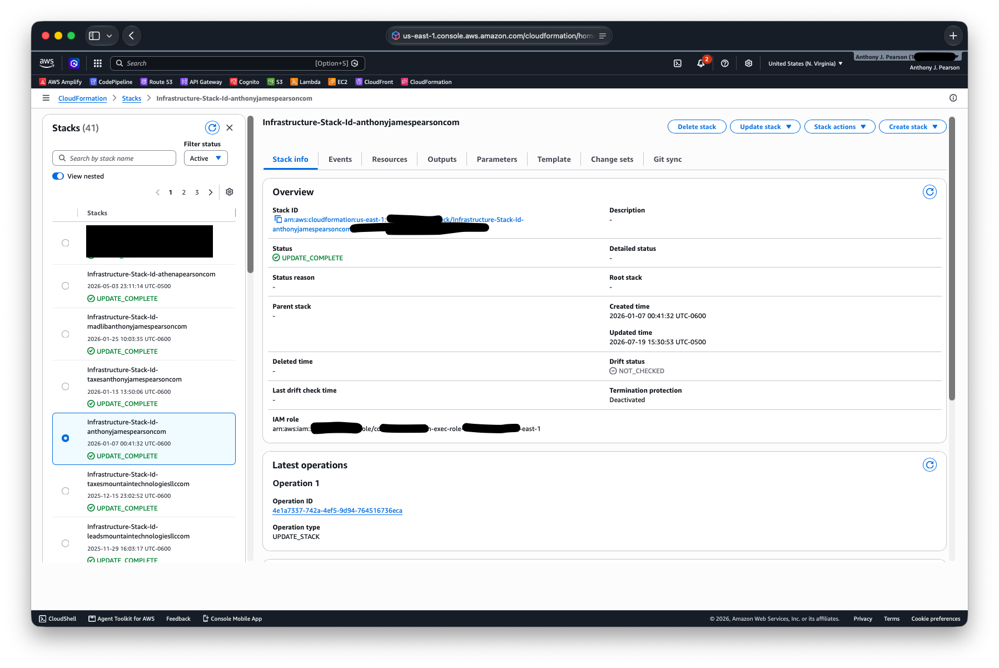

# Anthony James Pearson - Personal Website

My personal website built with Angular and AWS CDK, featuring a blog with markdown articles, user authentication, and custom email verification.

## Features

- **Modern Angular Frontend** - Built with Angular 21 and standalone components

- **Markdown Blog System** - Dynamic article rendering from markdown files

- **Responsive Design** - Built with [DaisyUI](https://daisyui.com) and [Tailwind CSS](https://tailwindcss.com)
- **User Authentication** - Cognito-based sign-up, login, password reset, and email verification

- **Custom Email Verification** - API Gateway + Lambda flow for click-to-verify emails

- **Security Headers** - CSP, HSTS, X-Frame-Options, and more via CloudFront

- **AWS Infrastructure** - Fully defined in C# with AWS CDK


## Project Structure

```
├── website/              # Angular 21 frontend application
├── infrastructure/       # AWS CDK infrastructure (C#/.NET 10)
│   └── src/Infrastructure/
│       ├── Constructs/
│       │   ├── BucketConstruct.cs              # S3 bucket for static hosting
│       │   ├── BucketDeploymentConstruct.cs    # S3 deployment with cache invalidation
│       │   ├── DistributionConstruct.cs        # CloudFront CDN + Route 53 DNS + ACM cert
│       │   ├── CognitoConstruct.cs             # User Pool, client, and auth triggers
│       │   ├── CustomMessageLambda.cs          # Custom email templates (Node.js 24)
│       │   └── VerificationConstructs/
│       │       ├── VerificationApiConstruct.cs  # API Gateway for email verification
│       │       └── VerificationLambdaConstruct.cs # Verification handler (.NET 10)
│       ├── InfrastructureStack.cs              # Main stack composition
│       └── Program.cs                          # CDK app entry point
├── lambda/
│   └── verification/     # Email verification Lambda (.NET 10)
└── README.md
```

## Development

### Prerequisites

- Node.js and npm
- .NET 10 SDK
- AWS CDK CLI (`npm install -g aws-cdk`)
- AWS credentials configured (`aws sts get-caller-identity`)

### Getting Started

```bash
git clone https://github.com/ajgoldenwings/anthonyjamespearson.com.git
cd anthonyjamespearson.com

# Install root dependencies
npm install

# Install website dependencies
cd website
npm install
```

Start the dev server:

```bash
npm run start
```

Navigate to `http://localhost:4200/`.

### Adding Articles

Articles are stored as markdown files in `website/public/articles/`. To add a new article:

1. Create a new `.md` file with the naming convention: `YYYY-MM-DD_Article-Title.md`
2. Add the article metadata to the articles list in `website/src/app/pages/articles/articles.ts`
3. The article will automatically be available at `/articles/YYYY-MM-DD_Article-Title`

## Infrastructure

The infrastructure is managed with AWS CDK (C#) and provisions:

- **S3** - Static website hosting with public read access
- **CloudFront** - Global CDN with optimized caching, security headers, and SPA error handling
- **Route 53** - DNS records for apex and www subdomain
- **ACM** - SSL certificate with DNS validation
- **Cognito** - User Pool with email sign-up, SES email integration, and custom message triggers
- **API Gateway** - REST API for email verification endpoint (`GET /verify`)
- **Lambda (Verification)** - .NET 10 function that confirms Cognito sign-ups and marks emails as verified
- **Lambda (Custom Message)** - Node.js 24 inline function that generates HTML emails for verification and password reset

### Deploy

```bash
# Synthesize CloudFormation template
npm run synth

# Preview changes
npm run diff

# Deploy everything (builds website + deploys infrastructure)
npm run deploy

# Tear down
npm run destroy
```

The deploy pipeline builds the Angular app first, then runs CDK deploy with the domain name context. The CDK pre-flight check ensures `website/dist/website/browser` exists before deploying.

### Build Lambda Separately

```bash
cd lambda/verification
dotnet restore
dotnet publish -c Release
```

## Technologies

- **Frontend**: Angular 21, TypeScript, DaisyUI, Tailwind CSS, ngx-markdown
- **Infrastructure**: AWS CDK (C#/.NET 10)
- **Auth**: Amazon Cognito with SES email
- **Hosting**: S3, CloudFront, Route 53, ACM
- **Lambda**: .NET 10 (verification), Node.js 24 (custom messages)

## License

This project is personal and proprietary. Please feel free to reach out for any correspondence.

## Author

**Anthony James Pearson**
- Website: [anthonyjamespearson.com](https://anthonyjamespearson.com)
- GitHub: [@ajgoldenwings](https://github.com/ajgoldenwings)
