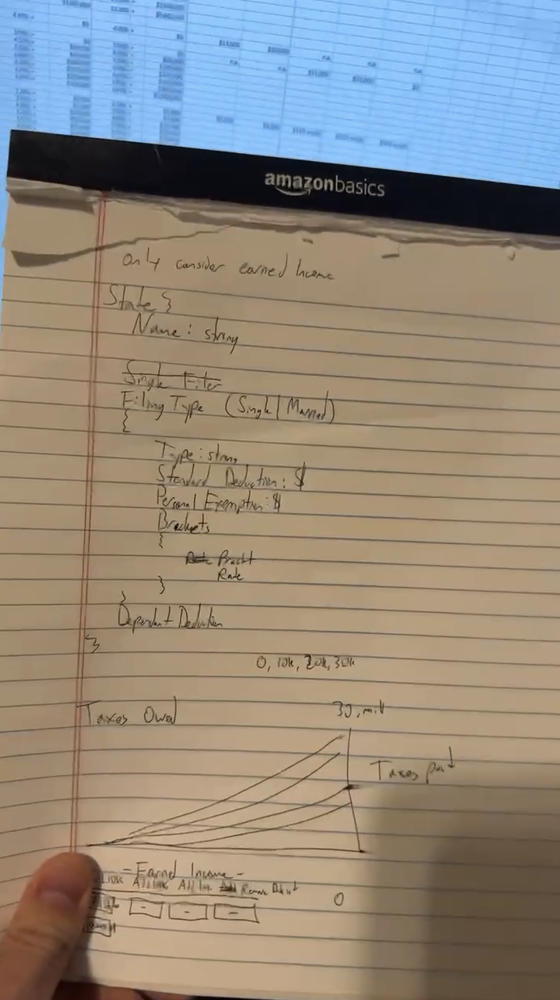

# The Tax Calculator That Built Itself

*A developer's experiment with AI reveals how artificial intelligence might reshape software creation*

  <iframe
    src="https://www.youtube.com/embed/ggEzyAjsKS0"
    title="Video of the Tax Calculator"
    frameborder="0"
    allow="accelerometer; autoplay; clipboard-write; encrypted-media; gyroscope; picture-in-picture; web-share"
    allowfullscreen
    class="h-full w-full"
  ></iframe>

Let me first begin by saying welcome back to my blog, and to those who are new, welcome! I am Anthony. I work with software every day, and when I find time, I may be tinkering with some tech or writing some code. So, what is this tax calculator?

Like many Americans considering a move to a different state or debating which state is the best (for taxes or anything), I wanted to understand how the tax burden would change state by state. But existing tax calculators were clunky, limited to single-state comparisons, and frustratingly static.

I did what any reasonable person might do in 2025: I asked an AI to build something.

"I want to create a taxes website called Mountain Taxes..." I typed into my computer. A couple of hours later, I had a fully functional web application that could compare income tax rates across all 50 states and income ranges, complete with interactive charts and professional-grade infrastructure.

The catch? I didn't write a single line of code—well, okay, that's not entirely true, but I coded less than 1% of it.

I want to give you a glimpse of a future where the gap between having an idea and building software has virtually vanished. Yet it forces us to confront a bigger question: What happens when literally anyone can create anything—and is that always a good thing?

## A Conversation, Not Code

The development process unfolded like a series of increasingly detailed conversations. I would describe what I wanted: "I want to use <a href="https://www.chartjs.org" target="_blank">Chart.js</a> line charts to show tax comparisons." The AI would respond not with suggestions or tutorials, but with working code.

The AI didn't just write code—it made architectural decisions, implemented security measures, and even wrote hundreds of automated tests.

## The Democratization Question

If I—who describes myself as "definitely not a programmer"—can create sophisticated software through conversation alone, what happens to the traditional software industry?

My estimated numbers suggest that hiring a development team to build something similar would have cost between $50,000 and $150,000 and taken three to six months. My build—with AI—cost me nothing and was completed in a single day. 

This isn't about replacing developers; it's about expanding who gets to be a developer.

## The Human Element

But the process wasn't entirely hands-off. I found myself playing the role of product manager, user experience designer, and quality assurance tester all at once. I had to understand what I wanted well enough to communicate it clearly, and I had to recognize when the AI's output met my needs.

The AI can do the heavy lifting in the logic department, but when it comes to reading my mind and knowing what looks and feels good—you know what I mean—AI can produce some subpar code.

## The Broader Implications

I'm hoping to bring in more expert voices as we're all riding this AI boom, but in this article, I want to stay on topic. It is really easy for me to say that non-experts can now accomplish expert-level tasks, but the truth is more nuanced. Many of the frameworks used require deep knowledge of them—though AI certainly helps bridge that gap.

More to come...

## Looking Forward

For now, I am focused on improving my tax calculator. I'm planning to add historical data as the years go by, more sophisticated tax scenarios, and perhaps integration with financial planning tools. Of course, I know you all might crave specific features—like support for additional state taxes or more detailed tax credits. But what about you? What features or integrations would you actually want to see?

And it all started with a simple conversation.

---

*Mountain Taxes is available at <a href="https://taxes.mountaintechnologiesllc.com" target="_blank">https://taxes.mountaintechnologiesllc.com</a>. The application is free to use and requires no registration.*
