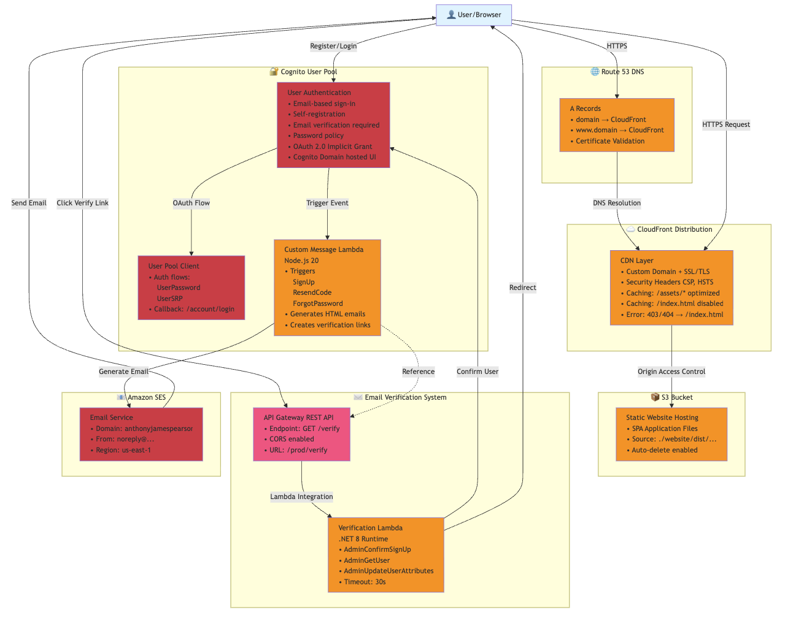

# My Current State of Infrastructure

*How I built a production-ready serverless architecture that powers this website—and what I learned along the way*

Many years ago, this website used bleeding edge web technologies that are now out of date. If you are interested, go and google <a href="https://www.google.com/search?q=Google+Polymer" target="_blank">Google Polymer</a> and see my old <a href="https://github.com/ajgoldenwings/AnthonyJamesPearson" target="_blank">Github website code</a>. 

When I set out to modernize this website, I made a few choices: embrace the serverless revolution to add a few features that are not in the old website, do not implement a fully SaaS product (I tried to have AI do a fully managed news website, which is a whole article on its own), and use frontend technologies Angular, Tailwind, DaisyUI, and ngx-markdown. But here's the thing—building infrastructure used to be the domain of DevOps engineers and cloud architects. Now, with tools like <a href="https://aws.amazon.com/cdk/" target="_blank">AWS CDK</a> and a little help from <a href="https://kiro.dev" target="_blank">Kiro</a>, an Agentic AI, I've created something that would have taken a team weeks to design and implement.

## The Foundation: Static First

At its core, this website is a single-page application (SPA). The compiled files sit in a AWS S3 bucket, served globally through CloudFront that comes with SSL/TLS, security headers, and caching web assets globally.

The beauty? Whenever there is a website change, there is no need to go to the AWS console or a server since deployments are handled through AWS CDK...<i>continue reading</i>.

## Infrastructure as Code

The entire architecture is defined in C# using AWS CDK. Every resource—buckets, distributions, Lambda functions, API gateways—is code. I can version it, review it, and deploy it with a single command (`npm run deploy:full`).

The CDK constructs I built are modular and reusable. Want to add another Lambda function? It's a few changes here and there. Need a new API endpoint? Same thing. The infrastructure grows with the application, and I may say I never have to click through the AWS console, but I only need to if there are features that require me to do an initial setup or for debugging.

## Authentication: The Cognito Puzzle

User authentication is where things get interesting. I wanted email-based sign-in, registration and verification. AWS Cognito handles this, but out of the box, its emails are... let's say "functional"... I didn't want my users to have to enter a 6-digit code from an email and not be directed back the website.

So, I built a custom message Lambda function that intercepts Cognito's email triggers (sign-up, resend code, forgot password) and generates branded HTML emails. It creates verification links that point to my custom API, giving me full control over the user experience.

The verification flow is better: user clicks the link in their email, hits an API Gateway endpoint, which triggers a Lambda function that confirms the user in Cognito and redirects them back to the website. It's seamless, and users never know they're bouncing between multiple AWS services.

## The Email Challenge

Not really a challenge but something that the CDK handled well. I'm using Amazon SES with a verified domain (anthonyjamespearson.com), which means my emails don't end up in spam folders. But setting this up required manually going into the AWS console to configuring DNS records, verifying domain ownership, removing sandbox restrictions, and making test emails to make sure it works.

It's one of those things that I just used what worked with AWS's default email but looked janky coming from a different website versus this website.

## The Cost Reality

Running this entire setup costs me less than $5 per month. CloudFront's free tier covers most of my traffic, S3 storage is cheap, Lambda functions only charge for actual execution time and Cognito has a generous free tier for the first 50,000 monthly active users. I would say the reregistering of the domain name is the most expensive cost.

Compare that to a traditional hosting setup with servers, databases, and load balancers—easily $50-$100 per month minimum, often much more.

## Looking Ahead

This infrastructure is just the beginning. I wanted to write this post as a milestone or a good stopping/starting point after completing the sign in/registration feature. I mean, there are no additional features or abilities you can do if you are logged in. So, looking ahead, maybe I will add a comment system, forms, store, or members only content—but why implement something if there are battle tested 3rd party tools.

For now, I'm enjoying the fact that this website runs itself. No servers to babysit, no scaling concerns, just pure functionality delivered at global scale.

---

*The complete infrastructure code is available in my repository. Feel free to explore, learn, and build something amazing. <a href="https://github.com/ajgoldenwings/anthonyjamespearson.com" target="_blank">github.com/ajgoldenwings/anthonyjamespearson.com</a>*

