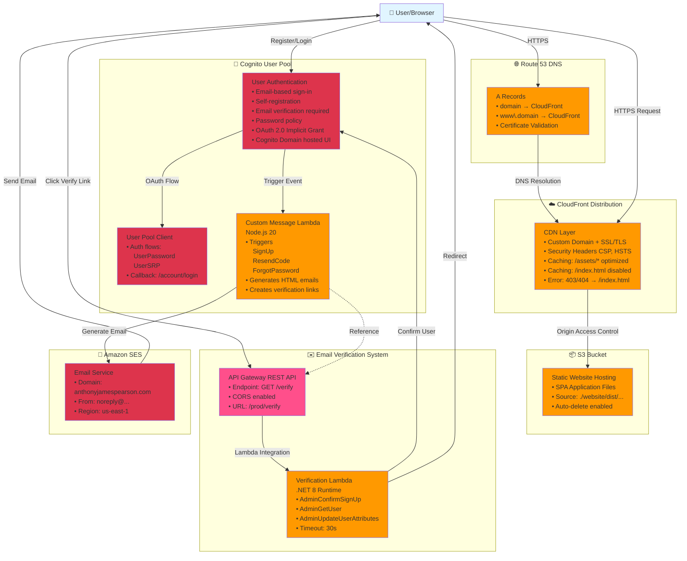

# Infrastructure Architecture Chart

## Overview
AWS CDK Infrastructure for a serverless web application with authentication and email verification.

## Architecture Diagram



## Component Details

### 1. Frontend Layer
- **CloudFront Distribution**: CDN with custom domain, SSL/TLS, security headers
- **S3 Bucket**: Static website hosting for SPA application
- **Route 53**: DNS management with A records for domain and www subdomain

### 2. Authentication Layer
- **Cognito User Pool**: User authentication and management
  - Email-based authentication
  - Self-registration with email verification
  - Password policy enforcement
  - OAuth 2.0 support
- **User Pool Client**: Application client for frontend integration

### 3. Email System
- **Custom Message Lambda**: Customizes Cognito email templates
  - Sign-up verification emails
  - Password reset emails
  - HTML formatted with branded styling
- **Amazon SES**: Email delivery service
  - Verified domain integration
  - Professional sender address

### 4. Verification System
- **API Gateway**: REST API endpoint for email verification
- **Verification Lambda**: Processes verification requests
  - Confirms user sign-up in Cognito
  - Updates user attributes
  - Handles redirects to website

## Data Flow

### User Registration Flow
```
1. User submits registration → Frontend
2. Frontend → Cognito User Pool (CreateUser)
3. Cognito → Custom Message Lambda (trigger)
4. Custom Message Lambda → Generates email with verification link
5. Cognito → SES → Sends email to user
6. User clicks link → API Gateway (/verify endpoint)
7. API Gateway → Verification Lambda
8. Verification Lambda → Cognito (AdminConfirmSignUp)
9. Verification Lambda → Redirects user to website
10. User can now log in
```

### Static Content Delivery Flow
```
1. User requests page → CloudFront
2. CloudFront checks cache
3. If miss → S3 Bucket (Origin)
4. CloudFront → Applies security headers
5. CloudFront → Returns content to user
```

## Stack Outputs
- Bucket Name
- Bucket Website URL
- CloudFront Distribution URL
- Cognito User Pool ID
- Cognito User Pool Client ID
- Cognito User Pool Domain
- Verification API URL

## Security Features
- HTTPS only (TLS 1.2+)
- Content Security Policy (CSP)
- Strict Transport Security (HSTS)
- X-Frame-Options (DENY)
- XSS Protection
- Origin Access Control for S3
- IAM least privilege for Lambda functions
- Cognito password policy enforcement

## Deployment Requirements
- AWS CDK context: `account`, `region`, `name`
- Pre-built website in `./website/dist/website/browser`
- Route 53 hosted zone for domain
- SES verified domain
